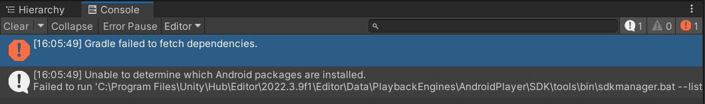

# Unity Blockchain Bootcamp 🚀
This repository is where I'll be documenting my progress and contributions during the bootcamp organized by Dojo Talent team. Our esteemed instructor, @TalhaCagatay, will be leading the way.

Here's what you can find here:

🔥 Homework Solutions: You can explore my implementations of the bootcamp's homework assignments.

💡 Problem Solving: Navigating the blockchain universe can be challenging. That's why I've taken the initiative to document and explain potential difficulties you may encounter during the bootcamp.

Join me on this exciting journey as we explore the world of blockchain technology. Feel free to explore the code, contribute your insights through pull requests, and let's grow together! 🌟
## Problems You Might Encounter
If you run into any of the following problems during the bootcamp, here are some solutions:

#### Gradle failed to fetch dependencies. (Android build)
Simply check "Custom Main Gradle Template" in Project Settings>Player>Publishing Settings, then Assets>External Dependency Manager>Android Resolver>Resolve. Finally, try rebuilding for Android.
#### Any Other Build Problems for Android
If you experience any other build problems for Android, go to Build Settings > Player Settings, and set the Minimum API level to Android 7.0 'Nougat' (API level 24).
#### MetaMask Wallet Doesn't Connect
If you're having trouble connecting to the MetaMask wallet, it may be due to a bug in the MetaMask phone app. Try killing the app completely, restart the Unity game, and then try to reconnect again.
#### Switching to Testnet and Testing Transactions
To test transactions, you first need to switch your MetaMask network to a testnet, preferably Goerli. Next, you need to acquire some Goerli ETH by using a faucet such as https://goerli-faucet.pk910.de/. Once you have the Goerli ETH, you can send it to an address that has a Goerli Ether address like a regular transaction.
